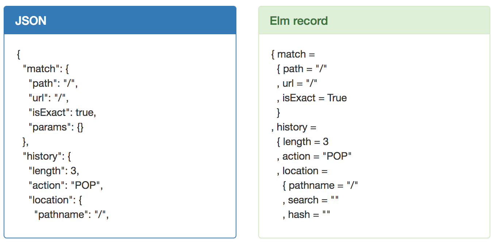

# JSON to Elm record

Convert instantly JSON objects to valid Elm records.

[Try it live!](https://pietro909.github.io/json-to-elm-record/dist/)

This tool is not meant to replace a careful modeling of your data,
 rather it is just a helper for rapid prototyping.



## Building

Clone the repo, then:

```
$ yarn
$ Yarn webpack
```

Open the page `dist/index.html` with your browser.

